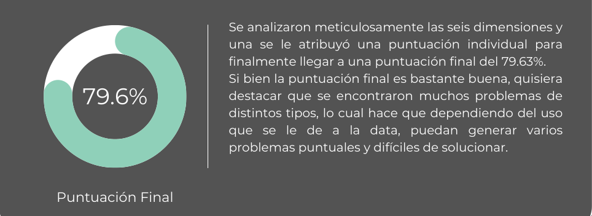
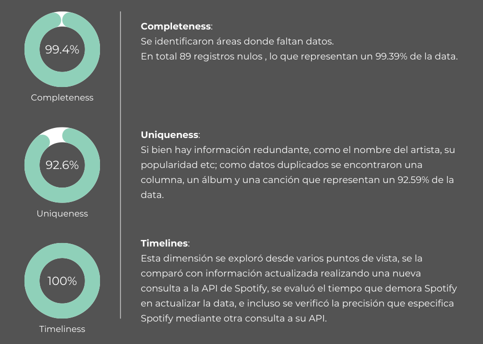
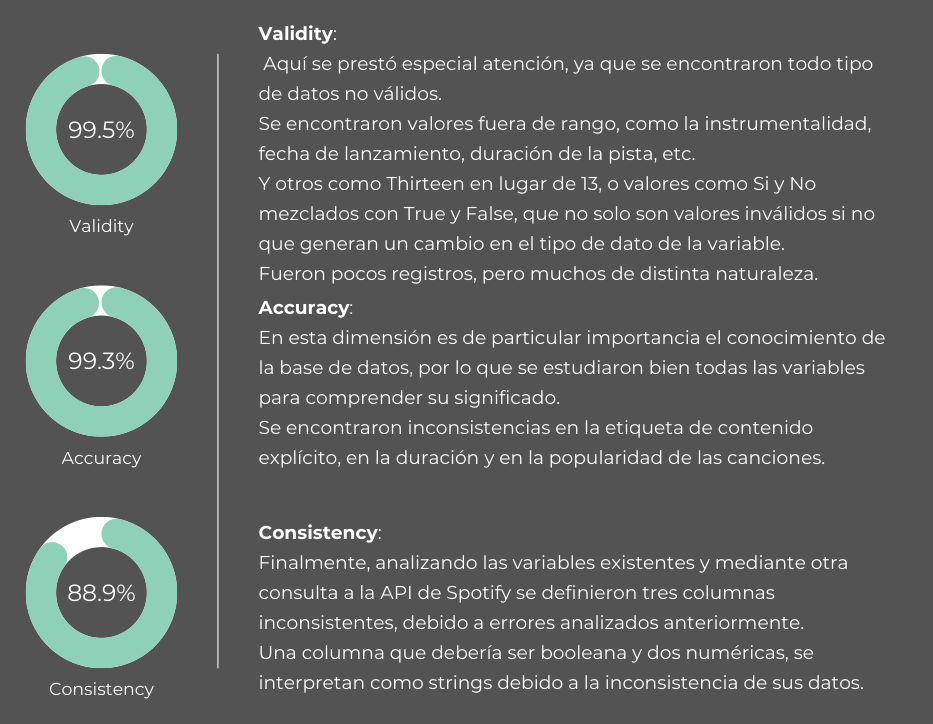

# Data Quality Assesment

Las consignas del trabajo consisten en realizar un script en python para leer un archivo **[taylor_swift_spotify.json](https://github.com/cristian-torres-ds/data_quality_engineer/blob/main/taylor_swift_spotify.json)** para convertirlo en un archivo tipo **[dataset.csv](https://github.com/cristian-torres-ds/data_quality_engineer/blob/main/dataset.csv)**.
Para luego tomar set de datos y realizar un análisis de calidad.

Para empezar se hizo una **[notebook](https://github.com/cristian-torres-ds/data_quality_engineer/blob/main/script_making.ipynb)** en la que se redactó y comprobó al **[script](https://github.com/cristian-torres-ds/data_quality_engineer/blob/main/python_script.py)** de Python para leer el set de datos en formato **.json** y generar otro en formato **.csv**.

Una vez obtenido el set de datos, se usó Python para realizar un **[análisis](https://github.com/cristian-torres-ds/data_quality_engineer/blob/main/data_quality_assessment.ipynb)** en profundidad todas las variables y se realizó un reporte de calidad de datos evaluando cuidadosamente las seis dimensiones primarias según **[DAMA UK Working Group](https://github.com/cristian-torres-ds/data_quality_engineer/blob/main/data-quality-deminsions.pdf)**, usando librerías como Pandas y Matplotlib.

  

  

